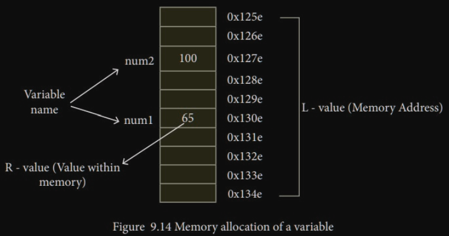

# **Learning C++**
 
> "It should have been one language"    
>
>Bjarne Btroustrup

# Basic programming concepts

### **To Compile** means:
- create the **.obj** (in Windows) file, by creating the **binary code**.

### **To Build** means:

- to **compile**
- to **link** the libraries/references used
- to create the **.exe** (in Windows) file.

### **To clean** means:

- **Delete** all the **.obj** files

### **To Rebuild** means:

- To **Clean** and then **Build**.

### **Compile Errors:**

- **Syntax** : **Error** in the **structure** of the code

- **Semantic** : **Error** in the **logical** meaning of the code

### **Compile Warnings:**

- **Something could be problematic, but it still works.**

Try not to ignore those warnings.

### **Linker Errors:**

- **Failing in finding the reference.**

### **Logical Errors:**

- **The one made by the programmers**

### **Keywords:**

- A set of words in a programming language, with a specific meaning. We cannot change the meaning of those words.
- In C++ there are 90ish KEYWORDS (int, char, return…)

### **Identifier:**

- Is a **name set by the programmer**, the name of a **function**, **struct**, **class…**

- example: std::cout

### **Operator**

- A set of signs with a meaning for each type. Their meaning can be overwritten by the programmer.  
- **+, -, \<\<(stream insertion operator), \>\>(stream extraction operator)**

### **Punctuation**

```c++ 
  { }
  ;
  ,
  .
  " "
```

All together they make the **Syntax**

### **Preprocessor and Directives - Macro**

Process the code source before the compiler.

- **Remove the comments** and sub them with a single space
- **Execute Directive**
  - **#**
  - **#include**
    - **Substitute** the 
    ```c++ 
    #include <iostream>
    ``` 
  (or other) with the **library/code** and recursively **preprocess** that **.**

**The preprocessor does not understand c++, simply follows the preprocessor directive and get the code ready for the compiler**

### **Main Function**

- **One must exist.**

- **Return** an **```int```**, 
  - **0** => **correct**, 
  - **something else** => **wrong**


```c++ 
  // applicationName.exe
  int main(){
    return 0;
  }

  // applicationName.exe argument1 argument2 
  int main(int argc, char* argv[]){   // argc counts arguments including app name
    return 0;
  }
``` 

### **ARGC: Argument count**

including the name of the application


### **ARGV: Argument vector**

including the name of the application

### **Namespaces**

Containers to group code entities in namespace scopes, allowing us to avoid name conflicts.

**```std::cout```** and **```andrea::cout```**

***```::```*** Scope Resolution Operator

we can avoid retyping every time the same namespace::identifier with **using**:

```c++ 
using namespace std; //using the entire namespace

using namespace std::cout; //using only that identifier in the namespace

using namespace std::cin;

using namespace std::endl;
```


## **I/O**

- **```std::cout << std::endl```** 
  
  goes to the **next line** and **flushes the buffer**

  - **```\n```** **just** goes to the **next line**

- **```std::cin```** 
      
    **Reads from the keyboard buffer**

    can be combined **```cin >> data1 >> data2```**  
    White spaces are ignored  
    if we have 2 cin, we can reuse the data in the buffer if is spaced, like: 
    ```c++ 
    std::cin >> a; 
    std::cin >> b;
    // By inserting in console:  "123 22"
    a = 123;
    b = 22;
    ```
    - we insert based on the **type specified**, can **throw errors**


- **```std::cerr```**
- **```std::clog```**

- **```<<```**  
  **Insertion operator**, output streams

- **```>>```**  
  **Extraction operator**, input streams

# Variables

> **The name associated with a specific Memory Address (L-Value) and the type of data (R-Value) that the variable will contain.**



## **Initializations**

**Never use a variable that is not initialized**

There are 3 types of initializations in C++

```c++

int age; // Un-initialized

int age = 21;   // .1 - C-Like initialization
int age (21);   // .2 - Constructor initialization
int age {21};   // .3 - C++ List initialization
```


## **Scope of a variable**

>The **area/region** of the code where we can **access** that specific **variable**;

- ### **Local variable** 
  - ```visible inside { }```
- ### **Global variable**   
  - ```visible``` in the ```hole program``` 
  - ```initialized at 0```;


### The compiler looks at variable like this:

- **First** in the scope which there is the variable (looks for a **```local variable```** dec)
- **Then** looks at the **```global variables```**

```c++
#include <iostream>

int age{19};

int main(){

  int age{21};
  std::cout << age << std::endl;

  return 0;
}
```


## **Primitive Data Types**

- ### **```Char```**
- ### **```Int```**
- ### **```Float/Double```**
- ### **```Boolean```**

The size and precision of these data types depend on the machine we are running the program on.  
With the preprocessor directive **```#include <climits>```** we can check that

Usual sizes and [precision](https://www.programiz.com/cpp-programming/data-types#:~:text=C%2B%2B%20int,values%20from%20%2D2147483648%20to%202147483647):

### **Char**

- **char:** 8 bits or 1 byte
- **char16\_t:** 16 bits or 2 bytes
- **char32\_t:** 32 bits
- **wchar\_t:** the largest available character set

Single quotes ' ' will make it a single character

Double quotes " " will make it a string, and give an error if saved into char.

### **Integer**

| _ **SIGNED** _ |
| --- |
| **short** | **16 bits - 2 bytes** |
| **int** | **32 bits - 4 bytes** |
| **long** | **32 bits - 4 bytes** |
| **long long** | **64 bits - 8 bytes** |

| _ **UNSIGNED** _ |
| --- |
| **unsigned short** | **16 bits - 2 bytes** |
| **unsigned int** | **32 bits - 4 bytes** |
| **unsigned long** | **32 bits - 4 bytes** |
| **unsigned long long** **64 bits - 8 bytes** |

### **Float**

| _ **FLOATs** _ |
 |
| --- | --- |
| **flaot** | **4 bytes** |
 |
| **double** | **8 bytes** |
 |
| **long double** | **12 bytes** |
 |

### **Booleans**

To store true or false

- Zero is **false**.
- Non-zero is **true**.

| **Booleans** |
| --- |
| **bool** | **1 byte** |

**Booleans**

**Sizeof()**

To check the size in bytes of a type, we can use the function sizeof(), depending on the machine and compiler we are using.

It comes from the packages **\<climits\>** (for ints) and **\<cfloat\>** (for floats)

They also give some informations about floats and ints

- INT\_MAX
- INT\_MIN
- LONG\_MIN
- LONG\_MAX
- FLT\_MIN
- FLT\_MAX

**Constants**

Variables with a constant value, they cannot change.

We have different type of constants:

- **Literal constants**
  - The value 12, always express 12
    - 12U 12 unsigned int
    - 0.5f float
    - \n or \r
- **Declared constants**
  - const keyword
    - const int a {12};
- **Constant Expressions**
  - constexpr keyword
- **Enumerated constants**
  - enum keywords
- **Defined constants**
  - #define, using preprocessor directive
  - #define pi 3.145926
  - Since the preprocessor don't know cpp, it cannot check for types

**Compound Types**

Types that are made of other types.

**Array**

A compound data type or a data structure that is a collection of elements, all elements must be of the same type.

Characteristics:

- Fix size
- Elements are all of the same type
- Stores contiguous in memory
- Can access each element by the index
  - Starting at 0
  - Ending at size-1
- No bounds check

**Declaration**

Element\_Type array\_name **[constant number of elements/size];**

**Initialization**

- int arr [3] {100, 2, 3}
- int arr [] {100, 2, 3} // Size is implicit
- **int arr [5] {0}** // Init all to zero, like a python vector operation
- **int arr [5] {}** // Init all to zero, like a python vector operation
- const int elements {5}
  - int arr [elements] {0}
- **ATTENTION**
  - **int arr [3] {100}**
    - **[0] 100**
    - **[1] 0**
    - **[2] 0**

**Memory**

The name of the array represent the address/location of the first element of the array (index 0)

The [index] represent the offset from the beginning of the array

That's why I can access it using its like a pointer and adding directly 1 to its address.

**Multidimensional arrays**

Element\_Type array\_name [dim1\_size][dim2\_size]

int movieRating [3][4];

**Vectors**

Vectors come from the **Standard Template Library** of c++.

Dynamic arrays.

**Initialization**


Already set at 0;


First parameter is the number of elements, the second parameter is the value at which every element will be set to.

**Access element**

- **[]**


No boundary check

- **.at ( index )**


Boundary check and throw an exception in the compiler

**Pointer**

A pointer is a variable storing as value the address of a variable/function.

Pointer has:

- Type
- Address
- Value: an address

int\* a;

int \*a;

If not initialized they point to somewhere in the memory, a junk address.

**Initialize**

int\* a{};

int\* a{nullptr};

**nullptr** (from c++ 11) represent address 0

**Address operator - &**

An operator that return the address in memory of the variable (L-value)


**Dereferencing**

accessing the data that the pointer is pointing to.

Get the L-value;


**Dynamic Memory Allocation**

Dynamically allocating memory on the heap


**De-allocating the memory**


Allocating an array with dynamic size.


**Memory Leak**

When we lose the pointer that is pointing to the memory allocated on the heap, we have a memory leak.

**Pointer Arithmetic**

**++ and —**


_**+/- sizeof( type )**_

To point to the next/previous array element. Incrementing by the size of the type we are currently pointing to. If is a int\*, it will add 4 bytes to the address of memory it is currently pointing at.

**+ and -**


increment/decrement by _**n \* sizeof( type )**_

– **between 2 pointers**

If the 2 pointer have the same type,

the subtraction will give us the number of elements between the 2.

**= or !=**

Determine if the 2 pointers are pointing at the same location or not


To compare the value of the data pointed to we need to dereference those pointers


**Const and pointers**

- **Pointer to constant**

The data pointed by the pointer is constant and cannot be changed

The pointer can change


- **Constant Pointer**

The pointer itself is constant, cannot point somewhere else.


- **Constant Pointer to Constant**

The data pointed cannot change, the pointer cannot point to something else.


**DON'T RETURN, FROM A FUNCTION, A POINTER FROM A VARIABLE ALLOCATED ON THE STACK**

**Dangling Pointer**

A pointer that is pointing to a block of memory that has been released, becoming invalid.

Example: 2 pointers that point to the same address, one releases the memory and the other one is still pointing to an invalid memory.

**Not Checking if NEW failed**

If _ **new** _ fails an exception is thrown, and dereferencing a nullptr will crash the program.

**Leaking Memory**

When a pointer to a block of memory is destroyed, that memory is still considered in use but we lost the pointer and so we cannot access it.

**Reference**

Is an alias for a variable

- Cannot be null
- Must be initialized to a variable when declared
- Cannot be made to reference another variable

Can be thinked as a const pointer that automatically dereference when used.

**ATTENTION:**

**str** will be a copy of the value contained in the vector, so it is not taking its referene, meaning that it will not change ithe value of the elements in the vector.


When using a reference it works.


**L-Values**

**An object that occupies space in memory and its addressable.**

- **Addressable: can be used in the left side of and assignment state.**


**(100+20) and "Frank" are R-VALUES.**

**R-Values**

Everything that is not an L-Value is an R-Value.

They are at the right side of an assignment expression.

- Litterals
- Temporary values


max(10, 20) is also an R-Value since its return is temporary and not addressable.

- R-Values can be assigned to L-Values explicitly

**Usage**

L-values can be both on left and right side of an assignment statement, R-Values can only be on the right.


**L-Value References**

**Referring to L-Values**

 

**Pointers v References parameters**

- **Pass-by-Value**
  - Default for C++
  - The Function do not modify the actual parameter
  - Copy of the parameter.
  - Useful for simple types (int, char, double …)

- **Pass-by-reference using a POINTER**
  - Function does modify the actual parameter
  - The parameter is expensive to copy (like a big structure)
  - Is allowed a nullptr value for the pointer (nullptr like leafs in trees)

- **Pass-by-reference using a POINTER to CONST**
  - Function does NOT modify the actual parameter
  - The parameter is expensive to copy (like a big structure)
  - Is allowed a nullptr value for the pointer (nullptr like leafs in trees)
  -
- **Pass-by-reference using a CONST POINTER to CONST**
  - Function does NOT modify the actual parameter
  - The parameter is expensive to copy (like a big structure)
  - Is allowed a nullptr value for the pointer (nullptr like leafs in trees)
  - Do NOT modify the pointer itself

- **Pass-by-reference using a REFERENCE**
  - Function does modify the actual parameter
  - The parameter is expensive to copy (like a big structure)
  - The parameter will never be nullptr

- **Pass-by-reference using a CONST REFERENCE**
  - Function does NOT modify the actual parameter
  - The parameter is expensive to copy (like a big structure)
  - The parameter will never be nullptr

# **OOP**

Model structure at an higher abstraction

- **Class**
- **Object**

**Encapsulation**

- **Abstract data-type**
- **Class/Object** contains **DATA** and **METHODS** on that data

**Information Hiding**

Hide implementation logic and provide interfaces to communicate with that code. (Private and Public)

**Reusability**

Reuse classes in more applications

**Inheritance**

Create a class in relation to another class, extending it.

Can access only its public methods.

**Class and Object**

A **class** is a user defined type, a model/blue-print. An **object** is an instance of a class.

A class can have data, **attributes,** and functions that operate on that data, called **methods.**

Thank to **encapsulation** and keywords **public** and **private** we can hide the implementation of those data and methods from the other classes, providing a public interface to interact with it.


**Accessing Class Members**

**Object**

- Dot operator

**Pointer**

- (Dereference)DotOperator
- Arrow Operator (Member of pointer operator)


**Class Member Access Modifiers**

- _ **public** _

Accessible everywhere

- _ **private** _

accessible only by members or friends of the class

- _ **protected** _

used with inheritance

**Implementing Member Methods**

- **Inside Class declaration**

They will become inline


- **Outside a Class declaration**

Need to use _class\_name::method\_name_


- **Separate declaration from implementation**
  - _.h/.hpp_ **declaration**
  - _.cpp_ **implementation**

To prevent the .h file to be included more than once, we can use

- **Include Guards**


- **Pragma Once**

Does the same job, but may be not declared in every compilers


## Constructors

A special member method:
- invoked during object creation.  
- Useful for initialization.
- Same name as the class
- No return type
- Can ve overloaded

```c++
class Player{
private:
  std::string name;
  int health;
  int xp;
public:
  // Overloaded Constructors
  Player();
  Player(std::string name);
  Player(std::string name, int health, int xp);
}
```

### Default Constructor

Called when we don't write any constructor.
- It does not require any parameters
- It does nothing, it only allocate memory with garbage values

```c++
Player frank;
Player* enemy = new Player;
```

If we write a Constructor, C++ will no longer generate it and it will be used the one you created.

```c++
class Player{
private:
  std::string name;
  int health;
  int xp;
public:
  int getHealth(){
    return this->health;
  }
  // Overloaded Constructors
  Player(){
    name = "None"
    health = 100;
    xp = 3;
  }
}

int main(){
  Player frank;
  std::cout << frank.getHealth();  // Output: 100

  return 0;
}
```

But if we create a non-default constructor and not a zero-args/default constructor, it will not be generated.

```c++
class Player{
private:
  std::string name;
  int health;
  int xp;
public:
  int getHealth(){
    return this->health;
  }
  // Overloaded Constructors
  Player(std::string n){
    this.name = n
    health = 100;
    xp = 3;
  }
}

int main(){
  Player frank; /// ERROR 

  // We have to do this
  Player frank = Player("halo")

  return 0;
}
```

### Constructor Initialization Lists

The other constructor are not really initializing the data with the value that we are passing. They allocate the memory with garbage values and the then change the values.  What we want to achieve is initializing the memory with the right values, making it more efficient and a true initialization.


We can to this with **List Initializer** that is just a list of initializer after the constructor declaration.

```c++
class Player{
private:
  std::string name;
  int health;
  int xp;
public:
  int getHealth(){
    return this->health;
  }

  Player(): name{"None"}, health{0}, xp{0} {
  }

  Player(std::string name_val, int health_val, int xp_val): 
      name{name_val}, health{health_val}, xp{xp_val} {
  }
}

int main(){
  Player frank;

  return 0;
}
```

The order of the member initialized is not important.

### Delegating Constructor

The goal is to reduce duplicated code.
We can **call another constructor from the initialization list**.  It works only with initialization list as in the example.

```c++
class Player{
private:
  std::string name;
  int health;
  int xp;
public:
  int getHealth(){
    return this->health;
  }

  Player(std::string name_val, int health_val, int xp_val): 
      name{name_val}, health{health_val}, xp{xp_val} {
  }

  Player(): Player{"None", 0, 0} {
  }

  Player(std::string name_val): Player{name_val, 0, 0} {
  }
}

int main(){
  Player frank;

  return 0;
}
```

### Default constructor

Provide default values in the constructor with optional parameters but be have to use initializer list so the compiler will take care of that.

```c++
class Player{
private:
  std::string name;
  int health;
  int xp;
public:
  Player(std::string name_val = "None",
          int health_val = 0,
          int xp_val = 0);
}

Player::Player(std::string name_val, int health_val, int xp_val): 
                name {name_val}, health{health_val}, xp{xp_val} {
}

Player empty;             // None, 0, 0
Player hero{"Hero", 100}; // Hero, 100, 0
```
They are really handy since with just one constructor, other n (n number of arguments) constructors will be generated at compile time.
We must not create ambiguous constructors, otherwise the complier will generate an error since it will not be able to understand which constructor to use.

## Copy Constructor

When objects are copied, C++ must create a new object from an existing object.  
When a copy is made?  
- **Passing** object by **value** as a parameter
- **Returning** an object from a function by **value**
- **Constructing** an object **based on another** of the same class

There is a default one if we do not specify one.

```c++
Player hero {"Hero", 100, 20};
displayPlayer(hero);

void displayPlayer(Player p){
  // p created as a COPY of hero
  // use p
  // Destructor of p will be called
}
```

```c++
Player enemy;
enemy = createSuperEnemy();

Player createSuperEnemy(){
  Player anEnemy{"Super Enemy", 1000, 1000};
  return anEnemy;   // A COPY of anEnemy is returned by value
}
```

```c++
Player hero {"Hero", 100, 20};
Player another_hero {hero}; // a COPY of hero is made
```

### Default copy constructor
Is the one generated if no copy constructor is specified.
- It will copy the values of each data member

- If you have and **object** as a member, their copy constructor will be called.
- If you have a **pointer** member:
  - Pointer will be copied
  - Not what it is pointing to (Shallow Copy)

### Best practices
- Provide a copy constructor when you have **raw pointers**.
- Provide the copy constructor with **const reference** parameter.
- STL classes already have a copy constructor
- Avoid using raw pointer data members, use smart pointer

### Implementation
```c++
// We want to use const ref, 
// as a ref: since if we were passing it by value we will end up in infinite recursive calls since we are providing a definition for a copy constructor
// as a const: since we dont want to modify the source object
Player::Player(const Player &source): 
  name{source.name}, health{source.health}, xp{source.xp}{
    // some extra code
    // std::cout << "Copy constructor called" << std::endl;
}

// We could also use a delegate constructor
Player::Player(const Player &source): 
  Player{source.name, source.health ,source.xp}{
}
```

### Shallow Copy

The default behavior provided by the compiler generated copy constructor. It creates a copy of all the members of the object. 

**Pointers are copied but not what they are pointing at.**

When we call the **Destructor** of the object at the r-value of the =, it releases the memory that our object is pointing at.

```c++
class Shallow {
private:
  int *data;
public:
  Shallow(int d);
  Shallow(const Shallow &source);
  ~Shallow();
}

Shallow::Shallow(int d) {
  data = new int;
  *data = d;
}
Shallow::~Shallow() {
  delete(data);
  std::cout << "Destructor";
}
// Same as default copy constructor
Shallow::Shallow(const Shallow &source)
  : data(source.data) {
    std::cout << "Copy constructor - shallow" << std::endl;
}
```

Now the source and the object how called the copy point to the same area of memory (with int* data).

```c++
void display_shallow(Shallow s){ // Passed by copy
  std::cout << s.getData() << std::endl;
}

int main() {
  Shallow obj1 {100};
  display_shallow(obj1);  // Passing it by Shallow Copy
  // obj1's data has been released
  // since it has been passed by copy 
  // and the copy goes out of scope

  obj1.set_data_value(1000);
  Shallow obj2 {obj1};
  std::cout << "Hello W" << std::endl;
  return 0;
}
```

### Deep Copy

The pointers arent copied, but the copied object will have a pointer to a unique storage of memory on the heap. Coping the data that the pointer is pointing to.

We use it when we have raw c++ pointers.

```c++
class Deep {
private:
  int *data;
public:
  Deep(int d);
  Deep(const Deep &source);
  ~Deep();
}
Deep::Deep(int d) {
  data = new int;
  *data = d;
}
Deep::~Deep() {
  delete(data);
  std::cout << "Destructor";
}

Deep::Deep(const Deep &source) {
  data = new int;
  *data = *source.data;

  std::cout << "Copy constructor - deep" << std::endl;
}
// We also can use a delegate constructor
Deep::Deep(const Deep &source) 
  : Deep{*source.data}{
  std::cout << "Copy constructor - deep" << std::endl;
}
```

There will not be anymore the problem of the shallow copy going out of scope and freeing memory pointed from someone else.

```c++
void display_deep(Deep s){ // Passed by copy
  std::cout << s.getData() << std::endl;
}

int main() {
  Deep obj1 {100};
  display_deep(obj1);  // Passing it by Shallow Copy

  obj1.set_data_value(1000);
  Deep obj2 {obj1};
  std::cout << "Hello W" << std::endl;
  return 0;
}
```

## Move Constructor

Introduced in C++ 11

In move semantics, r-values are temporary objects created by the compiler. And objects return from methods.  
If the copy constructor is called over and over again, it will make a lot of overhead, if we do deep copies, it is even bigger.

The **Move Constructor** moves the object instead of coping it.

They are optional but they are really efficient.  If in the debug you don't see copy or move constructor being called this could be because of **Copy elision**. In simpler wards, the compiler makes an optimization, removing un-necessary copies.

### R-Value References
References to the temporary objects created by the compiler. Called using **&&**.

```c++
int x {100};
int &l_ref = x; // L-value ref
l_ref = 10;     // change x to 10

int &&r_ref = 200;  // R-value ref
r_ref = 300;        // Change r_ref to 300

int &&x_ref = x;  // Compiler error
```
```c++
int x {100};  // x is an L-value

void funcA(int &num);  // A

funcA(x);  // Calls A - x is an L-value
funcA(200);   // ERROR - 200 is an R-value
```
```c++
int x {100};  // x is an L-value

void funcB(int &&num);  // B

funcB(200);  // Calls B - 200 is an R-value
funcB(x);  // ERROR - x is an L-value
```
```c++
int x {100};  // x is an L-value

void func(int &num);  // A
void func(int &&num);    // B

func(200);  // Calls B - 200 is an R-value
func(x);  // Calls A - x is an L-value
```

### Example-Move Class
```c++
class Move {
private:
  int* data;
public:
  void set_data_value(int d)  { *data = d;}
  int get_data_value()  { return *data; }
  Move(int d);  // Constructor 
  Move(const Move &source);  // Copy Constructor
  ~Move();
}
// Copy Constructor, Deep copy
Move::Move(const Move &source){
  data = new int;
  *data = *source.data;
}
```

``` c++
int main(){
  std::vector<Move> vec;

  vec.push_back(Move{10});  // Copy constr
  vec.push_back(Move{20});
}
```
Move{10} and Move{20} are R-values created by the constructor.

Let's add a **Move Constructor**.
- It will moves the resources on the heap.
- Copies the address of the resource from source to the current object.
- Nulls out the pointer in the source pointer.

#### Syntax
``` c++
Type::Type(Type &&source);
Move::Move(Move &&source);
```

### Move Constructor Implementation
```c++
class Move {
private:
  int* data;
public:
  void set_data_value(int d)  { *data = d;}
  int get_data_value()  { return *data; }
  Move(int d);  // Constructor 
  Move(const Move &source);  // Copy Constructor
  Move(Move &&source);  // Move Constructor
  ~Move();
}
// Move Constructor, it steals the data
Move::Move(Move &&source){
  : data{source.data};
  source.data = nullptr;
}
```
``` c++
int main(){
  std::vector<Move> vec;

  // Now the move constructor will be called
  vec.push_back(Move{10});  // Copy constr
  vec.push_back(Move{20});
}
```
## Destructors

A special member method, as a Constructor:

- Same name of class, but proceed with a tilde (~)
- Invoked automatically when the object is destroyed.
  - When the object goes out of scope
  - When we delete the pointer to an object
- No return type and no parameters
- Only 1 destructor per class is allowed
- Useful to release memory

```c++
class Player{
private:
  std::string name;
  int health;
  int xp;
public:
  // Overloaded Constructors
  Player();
  Player(std::string name);
  Player(std::string name, int health, int xp);
  
  // Destructor
  ~Player();
}
```

### Example
```c++
{
  Player slayer;
  Player frank("Frank", 100, 4);
  Player hero ("Hero");
  Player villain ("Villain");
  // Created 4 objects in the stack
  // When we go out of this scope they will be deleted
} // 4 destructors called


Player* enemy = new Player("Enemy", 1000, 0);
delete enemy; 
```

## This

**This** is a reserved keyword that contains the address of the object, so it's a pointer to itself.
- Can only be used in the scope of the class
- We can access all the members of the class

## Const in classes

We can use it for:

- Passing a const argument to a class method
- Create const objects

```c++
const Player villain {"Villain", 100, 55};

villain.setName("AAA"); // ERROR
std::cout << villain.getName() << std::endl;  // ERROR
// The compiler thinks that getName could change the object, 
// we should make it const
```
```c++
const Player villain {"Villain", 100, 55};

void DisplayName(const Player &p) {
  std::cout << p.getName() << std::endl;
}

DisplayName(villain); // ERROR
```

We should specify that the method will not modify the object.

```c++
class Player {
private:

public:
  std::string getName() const; 
   // The method will not modify the object
   // Will rise an ERROR if we try to modify the object
}

const Player villain {"Villain", 100, 55};
villain.getName(); 
```

## Static class members

When a member is **static** it means that it is related to the class in general and not to a specific instance of it, not to an object.

How can we keep track of how many objects of the same class, exists?
```c++
class Player {
private:
  static int numberOfPlayers;
public:
  static int getNumberOfPlayers();
  Player() {
    ...
    this->numberOfPlayers++;
  }
  ~Player(){
    this->numberOfPlayers--;
  }
}

// In the .cpp
#include "player.h";
int Player::numberOfPlayers = 0;
int Player::getNumberOfPlayers(){ // It can access only static data members.
  return Player::numberOfPlayers;
}
```


## **Struct**

They comes from C, they are simply a container for data.
It threats **strcuts** as **classes**, everything that you can do with classes you could do with structs.
Only difference:
- Struct members are public by default.
- Class members are private by default.

To differentiate them we could follows some guidelines:
- **Struct**
  - For passive objects with public access.
  - Do not declare methods inside the struct.

- **Classes**
  - Active objects with private fields.
  - Implement getter/setter when needed.
  - Implement member methods when needed.


## **Friend**

Is **function** or a **class** that has **access to the private class members.**
While not being a member of the class it is accessing.

If it is:
- **Function**
  - Can be regular **non-member function**
  - Can be **member** of another class
      The entire class will have access to the other class private members.
- **Class**

Some properties and rules of **Friendship**:
- **Friendship** must be **granted NOT taken**.
  - Declared explicitly in the class that is granting friendship
  - Declared in the function prototype with the keyword ```friend```

- **Friendship** is not **symmetric**
- **Friendship** is not transitive:
  - if A is friend of B
  - if A is friend of C
  - B is not friend of C or vice-versa

### Friend function of the same class
```c++
class Player {
private:
  static int numberOfPlayers;
  friend void displayPlayer(Player &p); // now this function has access to everything in that class
public:
}
void displayPlayer(Player &p){
  std::cout << p.numberOfPlayers << std::endl;
}
```
### Friend function of another class
```c++
class Player {
private:
  static int numberOfPlayers;
  friend void OtherClass::displayPlayer(Player &p); // now this function has access to everything in that class
public:
}

class OtherClass {
  void displayPlayer(Player &p){
    std::cout << p.numberOfPlayers << std::endl
  }
}
```
### Entire class as a Friend
```c++
class Player {
private:
  static int numberOfPlayers;
  friend class OtherClass;
public:
}
```

&nbsp;

# **Operator Overloading**


The traditional operators: ```+. -. *, /``` etc, are already implemented for built-in types (int, double...). We want to use this operators but for user-defined types. The only operator that is always implemented by default even for built-in operators is: ```=```, the others must be implemented.

**Cannot** be overloaded:

- ```::```  Scope resolution
- ```:?```  Conditional operator 
- ```.*```  
- ```.```
- ```sizeof```

## Rules

Some rules must be followed when overloading operators

- **Precedence** and **Associativity** cannot be changed.
- **arity** cannot be changed (Make the division operator **unary**).
- Can't overload operators for primitive type (int, double, etc)
- Can't create new operators
- ```[]```, ```()```, ```->``` and the assignment operator ```=```, must be declared as member methods.
- Other operators can be declared as member methods or global functions

## Copy Assignment Operator **```=```**

The Copy Assignment Operator **```=```** is not the initialization, that-s the constructor.  
Works with **L-value References**.

```c++
MyString s1{"Andrea"} 
MyString s2 = s1  // NOT assignment, but Initialization
                  // Is the same as s2{s1} 
s2 = s1;    // This is ASSIGNMENT
            // S2 has already been created
```

Default is memberwise assignment (**shallow copy**), if there are raw pointers, consider doing a **deep copy**.

### How to overload

```c++
Type &Type::operator=(const Type &rhs);
```
An example with the class created before

```c++
MyString &MyString::operator=(const MyString &rhs){
  if(this == &rsh)
    return this;

  delete [] this->str;
  str = new char[std::strlen(rsh.str) + 1]; // Deep Copy
  std::strcpy(str, rsh.str);

  return *this;
}
```

## Move Assignment Operator **```=```**

The Move Assignment Operator **```=```** works with **R-value References**.

### When will it be used?

```c++
MyString s1;
s1 = MyString{"Andrea"};  // Move Assignment
s1 = "Andrea";
```

### How to overload

```c++
Type &Type::operator=(const Type &&rValue);
```
```c++
MyString &MyString::operator=(const MyString &&rValue){
  if(this == &rValue)
    return this;

  delete [] this->str;    // deallocate current storage
  str = rValue.str; // Steal the pointer

  rValue.str = nullptr;

  return *this;
}
```